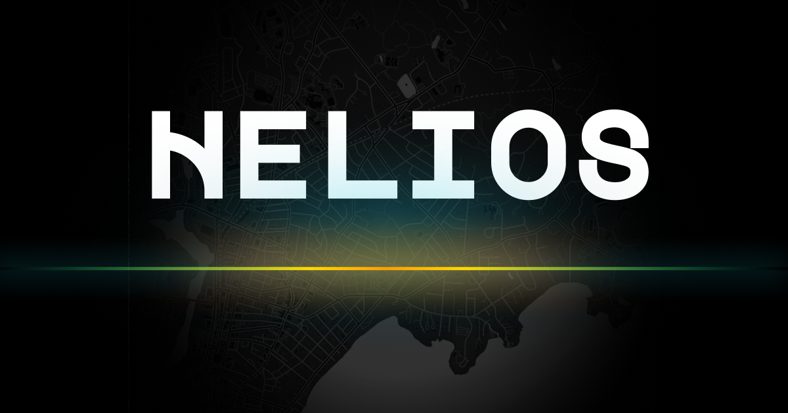

<p align="center">
  
</p>

<h3 align="center">Your running journey, visualized</h3>

<p align="center">
  Helios connects to Strava and transforms your running history into an immersive 3D timeline you can scroll through — every route rendered as a glowing line, color-coded by pace.
</p>

---

## Features

- **3D Route Visualization** — Each run rendered as a glowing tube in WebGL, colored by pace from warm (slower) to cool (faster)
- **Interactive Timeline** — Scroll through your entire running history; the focused run scales up with spring physics
- **Run Analytics** — Distance, pace, elevation, and duration for the focused run
- **Activity Photos** — Photos from your runs with pin locations on the route
- **Goal Tracking** — Weekly/monthly distance and run count goals with animated progress rings
- **Demo Mode** — Try it without connecting Strava

## Tech Stack

**App** — Next.js 16, React 19, TypeScript, Tailwind CSS 4

**3D & Animation** — Three.js, React Three Fiber, Framer Motion, MeshLine

**State** — Zustand

## Getting Started

```bash
# Clone and install
git clone https://github.com/your-username/helios.git
cd helios
npm install

# Set up environment variables
cp .env.example .env.local
# Add your Strava API credentials to .env.local

# Run the dev server
npm run dev
```

Open [http://localhost:3000](http://localhost:3000) to see the app. You can try demo mode without any Strava credentials.

### Environment Variables

| Variable | Description |
|---|---|
| `STRAVA_CLIENT_ID` | Your Strava API application client ID |
| `STRAVA_CLIENT_SECRET` | Your Strava API application client secret |
| `NEXT_PUBLIC_BASE_URL` | The app's base URL (defaults to `http://localhost:3000`) |

## Scripts

| Command | Description |
|---|---|
| `npm run dev` | Start the development server |
| `npm run build` | Create a production build |
| `npm run start` | Start the production server |
| `npm run lint` | Run ESLint |

## How It Works

1. Authenticate with Strava via OAuth
2. Your activities are fetched and polyline-encoded routes are decoded to coordinates
3. Routes are normalized, simplified, and smoothed with Catmull-Rom splines
4. Each run is rendered as a WebGL tube with per-vertex colors and a glowing tracer animation
5. Scroll position drives focus — the current run's stats, photos, and goal progress update in real time

## License

MIT
